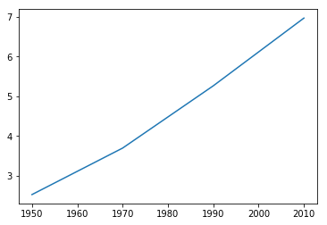
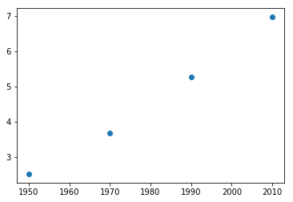

```python
import matplotlib
import matplotlib.pyplot as plt
matplotlib.use('Agg') # Must be before importing matplotlib.pyplot or pylab!
%matplotlib inline
```


```python
year = [1950, 1970, 1990, 2010]
population = [2.519, 3.692, 5.263, 6.972]
```


```python
plt.plot(year, population)
```


    [<matplotlib.lines.Line2D at 0x10e08b5f8>]


```python
plt.show()
```





```python
# Scatter plot
plt.scatter(year, population)
plt.show()
```





```python
# 
```
