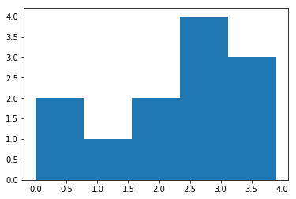

```python
import matplotlib.pyplot as plt
```


```python
help(plt.hist)
```

    Help on function hist in module matplotlib.pyplot:
    
    hist(x, bins=None, range=None, normed=False, weights=None, cumulative=False, bottom=None, histtype='bar', align='mid', orientation='vertical', rwidth=None, log=False, color=None, label=None, stacked=False, hold=None, data=None, **kwargs)
        Plot a histogram.
        
        Compute and draw the histogram of *x*. The return value is a
        tuple (*n*, *bins*, *patches*) or ([*n0*, *n1*, ...], *bins*,
        [*patches0*, *patches1*,...]) if the input contains multiple
        data.
        
        Multiple data can be provided via *x* as a list of datasets
        of potentially different length ([*x0*, *x1*, ...]), or as
        a 2-D ndarray in which each column is a dataset.  Note that
        the ndarray form is transposed relative to the list form.
        
        Masked arrays are not supported at present.
        
        Parameters
        ----------
        x : (n,) array or sequence of (n,) arrays
            Input values, this takes either a single array or a sequency of
            arrays which are not required to be of the same length
        
        bins : integer or array_like or 'auto', optional
            If an integer is given, `bins + 1` bin edges are returned,
            consistently with :func:`numpy.histogram` for numpy version >=
            1.3.
        
            Unequally spaced bins are supported if `bins` is a sequence.
        
            If Numpy 1.11 is installed, may also be ``'auto'``.
        
            Default is taken from the rcParam ``hist.bins``.
        
        range : tuple or None, optional
            The lower and upper range of the bins. Lower and upper outliers
            are ignored. If not provided, `range` is (x.min(), x.max()). Range
            has no effect if `bins` is a sequence.
        
            If `bins` is a sequence or `range` is specified, autoscaling
            is based on the specified bin range instead of the
            range of x.
        
            Default is ``None``
        
        normed : boolean, optional
            If `True`, the first element of the return tuple will
            be the counts normalized to form a probability density, i.e.,
            ``n/(len(x)`dbin)``, i.e., the integral of the histogram will sum
            to 1. If *stacked* is also *True*, the sum of the histograms is
            normalized to 1.
        
            Default is ``False``
        
        weights : (n, ) array_like or None, optional
            An array of weights, of the same shape as `x`.  Each value in `x`
            only contributes its associated weight towards the bin count
            (instead of 1).  If `normed` is True, the weights are normalized,
            so that the integral of the density over the range remains 1.
        
            Default is ``None``
        
        cumulative : boolean, optional
            If `True`, then a histogram is computed where each bin gives the
            counts in that bin plus all bins for smaller values. The last bin
            gives the total number of datapoints.  If `normed` is also `True`
            then the histogram is normalized such that the last bin equals 1.
            If `cumulative` evaluates to less than 0 (e.g., -1), the direction
            of accumulation is reversed.  In this case, if `normed` is also
            `True`, then the histogram is normalized such that the first bin
            equals 1.
        
            Default is ``False``
        
        bottom : array_like, scalar, or None
            Location of the bottom baseline of each bin.  If a scalar,
            the base line for each bin is shifted by the same amount.
            If an array, each bin is shifted independently and the length
            of bottom must match the number of bins.  If None, defaults to 0.
        
            Default is ``None``
        
        histtype : {'bar', 'barstacked', 'step',  'stepfilled'}, optional
            The type of histogram to draw.
        
            - 'bar' is a traditional bar-type histogram.  If multiple data
              are given the bars are aranged side by side.
        
            - 'barstacked' is a bar-type histogram where multiple
              data are stacked on top of each other.
        
            - 'step' generates a lineplot that is by default
              unfilled.
        
            - 'stepfilled' generates a lineplot that is by default
              filled.
        
            Default is 'bar'
        
        align : {'left', 'mid', 'right'}, optional
            Controls how the histogram is plotted.
        
                - 'left': bars are centered on the left bin edges.
        
                - 'mid': bars are centered between the bin edges.
        
                - 'right': bars are centered on the right bin edges.
        
            Default is 'mid'
        
        orientation : {'horizontal', 'vertical'}, optional
            If 'horizontal', `~matplotlib.pyplot.barh` will be used for
            bar-type histograms and the *bottom* kwarg will be the left edges.
        
        rwidth : scalar or None, optional
            The relative width of the bars as a fraction of the bin width.  If
            `None`, automatically compute the width.
        
            Ignored if `histtype` is 'step' or 'stepfilled'.
        
            Default is ``None``
        
        log : boolean, optional
            If `True`, the histogram axis will be set to a log scale. If `log`
            is `True` and `x` is a 1D array, empty bins will be filtered out
            and only the non-empty (`n`, `bins`, `patches`) will be returned.
        
            Default is ``False``
        
        color : color or array_like of colors or None, optional
            Color spec or sequence of color specs, one per dataset.  Default
            (`None`) uses the standard line color sequence.
        
            Default is ``None``
        
        label : string or None, optional
            String, or sequence of strings to match multiple datasets.  Bar
            charts yield multiple patches per dataset, but only the first gets
            the label, so that the legend command will work as expected.
        
            default is ``None``
        
        stacked : boolean, optional
            If `True`, multiple data are stacked on top of each other If
            `False` multiple data are aranged side by side if histtype is
            'bar' or on top of each other if histtype is 'step'
        
            Default is ``False``
        
        Returns
        -------
        n : array or list of arrays
            The values of the histogram bins. See **normed** and **weights**
            for a description of the possible semantics. If input **x** is an
            array, then this is an array of length **nbins**. If input is a
            sequence arrays ``[data1, data2,..]``, then this is a list of
            arrays with the values of the histograms for each of the arrays
            in the same order.
        
        bins : array
            The edges of the bins. Length nbins + 1 (nbins left edges and right
            edge of last bin).  Always a single array even when multiple data
            sets are passed in.
        
        patches : list or list of lists
            Silent list of individual patches used to create the histogram
            or list of such list if multiple input datasets.
        
        Other Parameters
        ----------------
        kwargs : `~matplotlib.patches.Patch` properties
        
        See also
        --------
        hist2d : 2D histograms
        
        Notes
        -----
        Until numpy release 1.5, the underlying numpy histogram function was
        incorrect with `normed`=`True` if bin sizes were unequal.  MPL
        inherited that error.  It is now corrected within MPL when using
        earlier numpy versions.
        
        Examples
        --------
        .. plot:: mpl_examples/statistics/histogram_demo_features.py
        
        .. note::
            In addition to the above described arguments, this function can take a
            **data** keyword argument. If such a **data** argument is given, the
            following arguments are replaced by **data[<arg>]**:
        
            * All arguments with the following names: 'weights', 'x'.
    


```python
values = [0,0.5,1.4,1.6,2.2,2.5,2.6,3.2,3.5,3,3.9,2.6]
plt.hist(values, bins=5)
```


    (array([ 2.,  1.,  2.,  4.,  3.]),
     array([ 0.  ,  0.78,  1.56,  2.34,  3.12,  3.9 ]),
     <a list of 5 Patch objects>)


```python
plt.show()
```





```python

```
