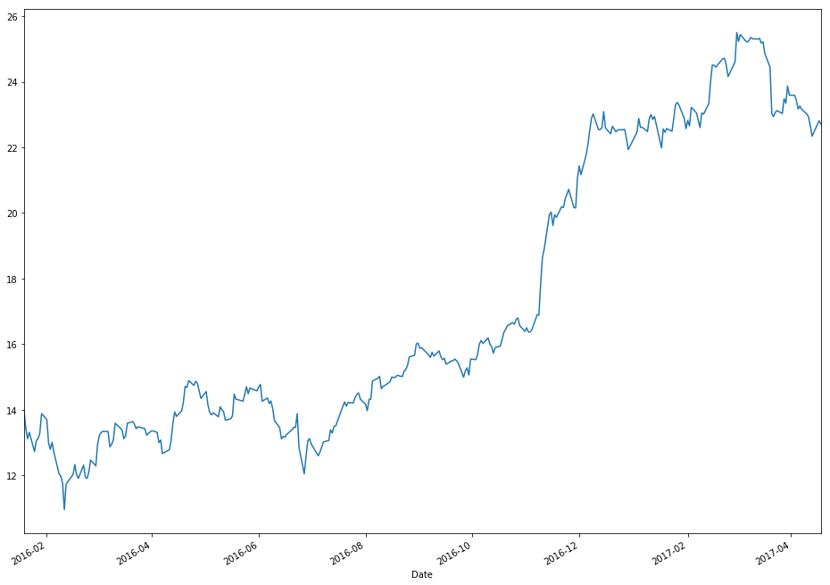
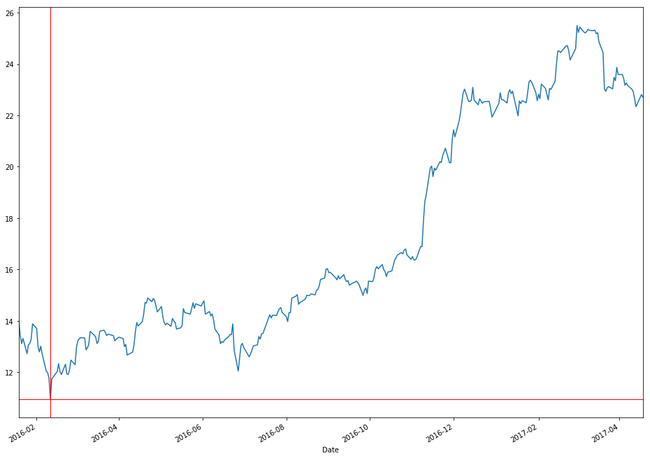

```python
#import pandas
import pandas as pd
from datetime import date
```


```python
# create a new variable to hold data and set dates as index
new_file = pd.read_csv("BAC.csv",parse_dates=['Date'])
new_file.set_index('Date',inplace=True)  
new_file.tail()
    
```


<div>
<table border="1" class="dataframe">
  <thead>
    <tr style="text-align: right;">
      <th></th>
      <th>Open</th>
      <th>High</th>
      <th>Low</th>
      <th>Close</th>
      <th>Volume</th>
      <th>Adj Close</th>
    </tr>
    <tr>
      <th>Date</th>
      <th></th>
      <th></th>
      <th></th>
      <th></th>
      <th></th>
      <th></th>
    </tr>
  </thead>
  <tbody>
    <tr>
      <th>2016-01-25</th>
      <td>13.54</td>
      <td>13.55</td>
      <td>12.94</td>
      <td>12.96</td>
      <td>186419100</td>
      <td>12.721498</td>
    </tr>
    <tr>
      <th>2016-01-22</th>
      <td>13.65</td>
      <td>13.72</td>
      <td>13.47</td>
      <td>13.56</td>
      <td>169999800</td>
      <td>13.310457</td>
    </tr>
    <tr>
      <th>2016-01-21</th>
      <td>13.67</td>
      <td>13.84</td>
      <td>13.25</td>
      <td>13.36</td>
      <td>188976000</td>
      <td>13.114136</td>
    </tr>
    <tr>
      <th>2016-01-20</th>
      <td>13.79</td>
      <td>14.00</td>
      <td>13.27</td>
      <td>13.69</td>
      <td>250537600</td>
      <td>13.438063</td>
    </tr>
    <tr>
      <th>2016-01-19</th>
      <td>14.69</td>
      <td>14.79</td>
      <td>14.01</td>
      <td>14.24</td>
      <td>185727400</td>
      <td>13.977942</td>
    </tr>
  </tbody>
</table>
</div>


```python
#import matplotlib
import matplotlib.pyplot as plt
```


```python
# use plot and plt.show() to plot graph
new_file['Adj Close'].plot(figsize=(16, 12))
plt.show()
```





```python
# lets get the minimum Adj closing price and get index
min_close_price = new_file['Adj Close'].min()
idx_close_price = new_file['Adj Close'].idxmin()
print(min_close_price)
idx_close_price
```

    10.954623


    Timestamp('2016-02-11 00:00:00')


```python
# now we want to draw lines at that index and min price
new_file['Adj Close'].plot(figsize=(16, 12))
verical_line = plt.axvline(date(2016,2,11), linewidth=1, color='r')
horizontal_line = plt.axhline(y=min_close_price, linewidth=1, color='r')
```


```python
# if you want to save this chart do it before you call show()

plt.savefig('classstock.pdf', format='pdf')
```


```python
plt.show()
```





```python

```
