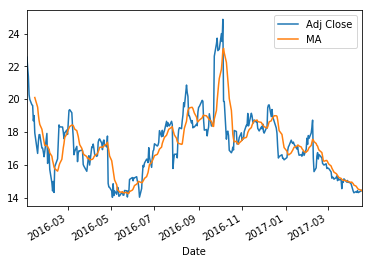
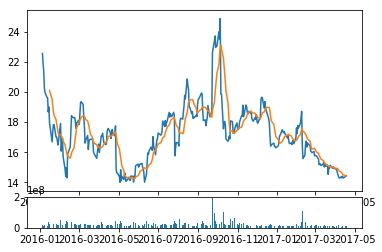

```python
# Importing liabraries and DataReader
import pandas as pd 
import pandas_datareader.data as web
import matplotlib.pyplot as plt 
import datetime
from datetime import date
```


```python
# Setting time range
start = date(2016,1,1)
end = date.today()
```


```python
# Getting data for a stock
stock_price = web.DataReader("TWTR", "yahoo", start, end)
stock_price.tail()
```


<div>
<table border="1" class="dataframe">
  <thead>
    <tr style="text-align: right;">
      <th></th>
      <th>Open</th>
      <th>High</th>
      <th>Low</th>
      <th>Close</th>
      <th>Volume</th>
      <th>Adj Close</th>
    </tr>
    <tr>
      <th>Date</th>
      <th></th>
      <th></th>
      <th></th>
      <th></th>
      <th></th>
      <th></th>
    </tr>
  </thead>
  <tbody>
    <tr>
      <th>2017-04-11</th>
      <td>14.30</td>
      <td>14.40</td>
      <td>14.20</td>
      <td>14.31</td>
      <td>7588600</td>
      <td>14.31</td>
    </tr>
    <tr>
      <th>2017-04-12</th>
      <td>14.34</td>
      <td>14.78</td>
      <td>14.26</td>
      <td>14.42</td>
      <td>12898700</td>
      <td>14.42</td>
    </tr>
    <tr>
      <th>2017-04-13</th>
      <td>14.49</td>
      <td>14.50</td>
      <td>14.22</td>
      <td>14.30</td>
      <td>10522600</td>
      <td>14.30</td>
    </tr>
    <tr>
      <th>2017-04-17</th>
      <td>14.30</td>
      <td>14.55</td>
      <td>14.12</td>
      <td>14.40</td>
      <td>10032000</td>
      <td>14.40</td>
    </tr>
    <tr>
      <th>2017-04-18</th>
      <td>14.37</td>
      <td>14.56</td>
      <td>14.27</td>
      <td>14.44</td>
      <td>9687900</td>
      <td>14.44</td>
    </tr>
  </tbody>
</table>
</div>


```python
stock_price["MA"] = stock_price["Adj Close"].rolling(window=10).mean()
# stock_price.head()
stock_price.tail()
```


<div>
<table border="1" class="dataframe">
  <thead>
    <tr style="text-align: right;">
      <th></th>
      <th>Open</th>
      <th>High</th>
      <th>Low</th>
      <th>Close</th>
      <th>Volume</th>
      <th>Adj Close</th>
      <th>MA</th>
    </tr>
    <tr>
      <th>Date</th>
      <th></th>
      <th></th>
      <th></th>
      <th></th>
      <th></th>
      <th></th>
      <th></th>
    </tr>
  </thead>
  <tbody>
    <tr>
      <th>2017-04-11</th>
      <td>14.30</td>
      <td>14.40</td>
      <td>14.20</td>
      <td>14.31</td>
      <td>7588600</td>
      <td>14.31</td>
      <td>14.632</td>
    </tr>
    <tr>
      <th>2017-04-12</th>
      <td>14.34</td>
      <td>14.78</td>
      <td>14.26</td>
      <td>14.42</td>
      <td>12898700</td>
      <td>14.42</td>
      <td>14.570</td>
    </tr>
    <tr>
      <th>2017-04-13</th>
      <td>14.49</td>
      <td>14.50</td>
      <td>14.22</td>
      <td>14.30</td>
      <td>10522600</td>
      <td>14.30</td>
      <td>14.508</td>
    </tr>
    <tr>
      <th>2017-04-17</th>
      <td>14.30</td>
      <td>14.55</td>
      <td>14.12</td>
      <td>14.40</td>
      <td>10032000</td>
      <td>14.40</td>
      <td>14.453</td>
    </tr>
    <tr>
      <th>2017-04-18</th>
      <td>14.37</td>
      <td>14.56</td>
      <td>14.27</td>
      <td>14.44</td>
      <td>9687900</td>
      <td>14.44</td>
      <td>14.413</td>
    </tr>
  </tbody>
</table>
</div>


```python
# stock_price.plot()
stock_price[["Adj Close", "MA"]].plot()
plt.show()
```





```python
# we create grids
price_fig = plt.subplot2grid((6,1),(0,0), rowspan=5, colspan=1)
volume_fig = plt.subplot2grid((6,1),(5,0), rowspan=1, colspan=1, sharex=price_fig)
```


```python
price_fig.plot(stock_price.index, stock_price['Adj Close'])
price_fig.plot(stock_price.index, stock_price['MA'])
volume_fig.bar(stock_price.index, stock_price['Volume'])

plt.show()
```





```python

```
